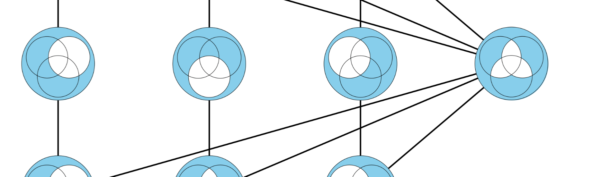

.. Syntropy documentation master file, created by
   sphinx-quickstart on Wed Nov  5 16:27:52 2025.
   You can adapt this file completely to your liking, but it should at least
   contain the root `toctree` directive.

Syntropy documentation
======================

**Syntropy** is a Python library for multivariate information theoretic analysis of discrete and continuous data.
It provides efficient implementations of a large variety of information measures, from basic functions like the Shannon entropy, mutual information, and Kullback-Leibler divergence, to modern constructs like the partial information decomposition, higher-order measures (e.g. the O-information), and information rates for time series data.

Examples
--------
.. code-block:: python

   #############################################################
   # Examples of multiple measures with discrete distributions + estimators.
   #############################################################
   from syntropy.discrete import mutual_information, kullback_leibler_divergence, o_information, partial_information_decomposition
   from syntropy.discrete.distributions import XOR_DIST, MAXENT_DIST_3
   
   # Mutual information
   ptw, avg = mutual_information(
        idxs_x = (0,1), 
        idxs_y = (2,), 
        joint_distribution=XOR_DIST
        )
   print(f"I(X1,X2 ; Y) = {avg}") # Equal to 1 bit. 
   
   # Kullback-Leibler divergence
   ptw, avg = kullback_leibler_divergence(
        posterior_distribution = XOR_DIST,
        prior_distribution = MAXENT_DIST_3
   )
   print(f"D_KL(XOR || MAXENT) = {avg}") # Equal to 1 bit. 
   
   # O-information
   ptw, avg = o_information(XOR_DIST)
   print(f"O-information(XOR) = {avg}") # Equal to -1 bit.
   
   # Partial information decomposition
   ptw, avg = partial_information_decomposition(
        inputs = (0,1),
        target = (2,),
        joint_distribution = XOR_DIST,
        redundancy_function = "ipm"
   )
   print(f"Redundancy: {avg[((0,),(1,))]}\nUnique 0: {avg[((0,),)]}\nUnique 1: {avg[((1,),)]}\nSynergy: {avg[((0,1),)]}")
   # Equal to: 0.0 bit, 0.0 bit, 0.0 bit, 1.0 bit

   ############################################################
   # Example with Gaussian estimator 
   ############################################################

   import numpy as np 
   from scipy.stats import multivariate_normal
   from syntropy.gaussian import mutual_information, local_mutual_information, kullback_leibler_divergence, partial_information_decomposition, o_information, local_o_information
   
   # Generating some data
   num_samples = 1_000_000
   cov = np.array([
        [0.99999999, 0.24404644, 0.65847509],
        [0.24404644, 0.99999985, 0.24163274],
        [0.65847509, 0.24163274, 0.99999996]
        ])
   data = multivariate_normal.rvs( # Generate data for finite sizes. 
        mean = [0,0,0],
        cov = cov,
        size=num_samples
        ).T
   emp = np.cov(data, ddof=0) # Empirical covariance for finite-sample estimates.

   # Mutual information
   avg = mutual_information(
        idxs_x = (0,1),
        idxs_y = (2,),
        cov = emp
        )
   print(f"I(X;Y) = {avg:.3} nat")

   # Local mutual information.
   local = local_mutual_information(
        idxs_x=(0,1),
        idxs_y = (2,),
        cov = emp,
        data = data
        )
   print(f"E[local] = avg: {np.isclose(avg, local.mean())}")

   maxent = np.array([
        [1.0, 0.0, 0.0],
        [0.0, 1.0, 0.0],
        [0.0, 0.0, 1.0]
        ])

   # Kullback-Leibler divergence
   dkl = kullback_leibler_divergence(
        cov_posterior = cov,
        cov_prior = maxent
        )
   print(f"D_KL(cov || I) = {dkl:.3} nat")
   
   # O-information + local O-information
   oinfo = o_information(
        cov = emp
        )
   local_o = local_o_information(
        data = data
   )
   print(f"O-information(X) = {oinfo:.3} nat")
   print(f"E[local_o] = oinfo: {np.isclose(oinfo, local_o.mean())}")
   
   # Partial information decomposition
   ptw, avg = partial_information_decomposition(
       inputs = (0,1),
       target = (2,),
       data = data,
       redundancy_function = "ipm"
   )
   print(f"Redundancy: {avg[((0,),(1,))]}\nUnique 0: {avg[((0,),)]}\nUnique 1: {avg[((1,),)]}\nSynergy: {avg[((0,1),)]}")

   #############################################################
   # Example with Kraskov estimator
   #############################################################
   # this uses the same Gaussian data as above 
   # to allow comparability
   from syntropy.knn import mutual_information, o_information 
   # Note that there is no KNN-based DKL or PID.
   
   data = data[:,:100_000] # Reducing the number of data points.
   
   # Mutual information 
   ptw, avg = mutual_information(
        idxs_x=(0,1),
        idxs_y=(2,),
        data=data,
        k = 5,
        algorithm = 1 # Whether to use the KSG1 or KSG2 MI estimator.
   )
   print(f"I(X;Y) = {avg:.3} nat") # Should be similar to the Gaussian MI above.
   
   # O-information
   ptw, avg = o_information(
        data = data, 
        k = 5,
   ) 
   print(f"O-information(data) = {avg:.3} nat") # Should be similar to the Gaussian O-information given above.

.. toctree::
   :maxdepth: 2
   :caption: Getting Started:

   installation
   quickstart

.. toctree::
   :maxdepth: 2
   :caption: API Reference:

   api/syntropy

.. toctree::
   :maxdepth: 1
   :caption: Additional Information:

   theory
   contributing
   changelog

Indices and tables
==================

* :ref:`genindex`
* :ref:`modindex`
* :ref:`search`

.. toctree::
   :maxdepth: 2
   :caption: Contents:

